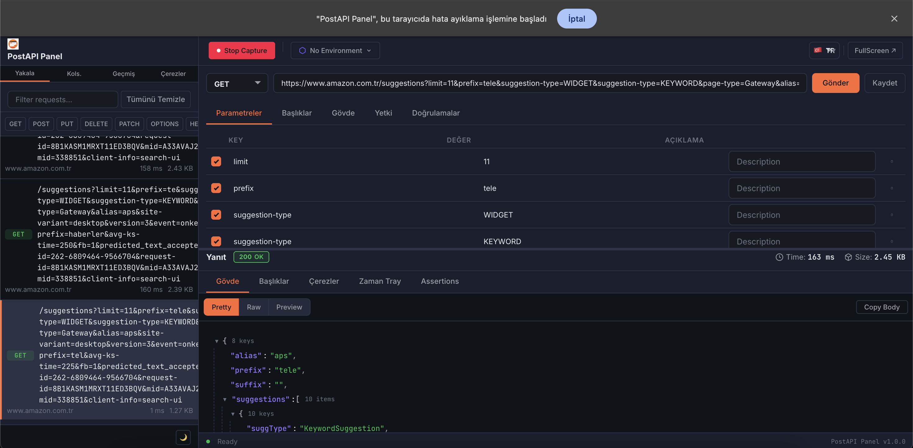
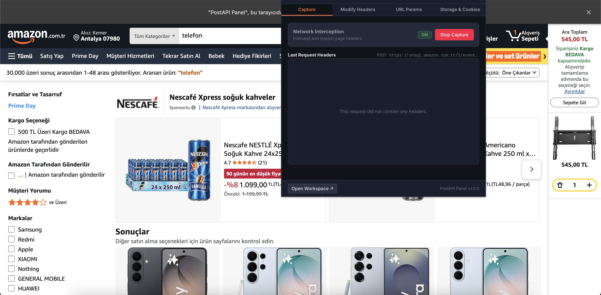

# PostAPI Panel — Chrome Extension API Client & Debugger

PostAPI Panel is a premium, developer-focused REST, SOAP, and HTTP API client built directly into Google Chrome. By integrating into Chrome DevTools, the Extension Action Popup, and the Side Panel, it provides a CORS-free, browser-native playground for capturing, debugging, and testing web application endpoints in real-time.

---

## 📸 Application Interface & Screens

### 1. Extension Popup Panel
The Popup Panel is a lightweight, on-the-fly panel accessible directly from the browser's toolbar extension icon. It is designed for fast inspection and testing of the active website context.

* **Network Interception Control**: Quick toggle to turn request capturing on/off for the active tab context.
* **Header Modification Rules**: Append, edit, or remove request headers dynamically for the active domain using Chrome's Declarative Net Request (DNR) API.
* **URL Parameter Editor**: View, add, delete, or modify query parameters from the active tab's URL and reload the page with one click.
* **Cookie & Storage Inspector**: View, search, edit, copy, or delete cookies, `localStorage`, and `sessionStorage` variables. It automatically prioritizes authentication tokens and JWTs at the top.
* **Open Workspace ↗**: Located in the footer, it launches the full-featured, full-screen developer workspace in a dedicated tab linked to the active browser tab.

---

### 2. DevTools Workspace & Navigation
Integrated as a tab inside Chrome DevTools (`F12`), the workspace provides a comprehensive split-pane API client.

* **PostAPI Navigation Menu (Sidebar)**:
  * **Capture**: View the live log of XHR/Fetch network requests intercepted from the inspected page. Click any request to load its method, URL, headers, and body directly into the builder.
  * **Colls (Collections)**: Save, group, and manage request templates into folder hierarchies for repeatable testing. Supports importing/exporting Postman (v2.1) and native configurations.
  * **History**: Review past API requests executed from the builder, complete with response statuses, durations, and sizes.
  * **Cookies**: Manage, edit, and delete browser cookies for the active domain.
* **Header Toolbar**:
  * **Start/Stop Capture**: Control background network interception (Chrome DevTools Protocol - CDP) for the inspected tab.
  * **Environment Selector**: Switch environments and manage variables (e.g. `{{host}}`, `{{token}}`) with resolving toggle controls.
  * **FullScreen ↗**: Open the workspace in a dedicated full-screen browser tab.
* **Split-Pane Builder**:
  * **Top Pane (Request Builder)**: Build and customize requests (HTTP Method, URL, Headers, Parameters, Authentication, Request Body, and automated Assertions).
  * **Bottom Pane (Response/Diff Viewer)**: Analyze API responses (Status Code, Time, Payload Size, JSON Tree explorer, raw text, and assertion pass/fail results). It also includes a **Diff Viewer** to compare two responses side-by-side.

---

## ❓ Why Developers & Test Users Need PostAPI Panel

Testing and debugging APIs during web development usually requires constantly switching context between the browser and external tools like Postman. PostAPI Panel bridges this gap by embedding a powerful client directly into the browser's runtime environment.

### Problems It Solves:
* **The CORS Nightmare**: Standard web applications are restricted by CORS policies. PostAPI Panel runs its requests inside the extension's background script context, completely bypassing browser CORS restrictions. You can test your endpoints without having to configure local CORS headers on your API server.
* **Manual Token & Cookie Syncing**: Copy-pasting JWT authorization headers or session cookies from Chrome DevTools to external clients is tedious and breaks constantly as sessions expire. PostAPI Panel is browser-native; it reads the active tab's cookies and storage, letting you authenticate requests instantly without manual copying.
* **Reproducing Complex Request States**: Recreating a request with nested query params, headers, and large JSON payloads in another tool is time-consuming. PostAPI Panel's real-time CDP capture interceptor logs requests and maps them to the Request Builder with a single click.
* **Testing Edge Cases in Header/Query Data**: If you want to test how your backend responds to missing headers, custom roles, or localized parameters, you can write active modifier rules in the Popup Panel. They inject headers on all outgoing browser requests instantly, allowing you to test edge cases directly in your application UI.
* **Automated Visual Assertions**: Define, execute, and verify validation rules directly on API response metadata and payloads (e.g., status codes, response times, header values, or JSON path queries like `$.data.id` is not null).

---

## 🌟 Key Features

### 1. Dual-Pane Developer Console
* **Split Layout Interface**: Clean navigation panel for Capture, Collections, History, and Cookies alongside a split horizontal request builder/response viewer workspace.
* **Modern Design & Themes**: High-contrast charcoal and deep blue styling matching standard DevTools IDEs with full support for Light and Dark themes.

### 2. Network Request Capture (Chrome CDP)
* Hook into specific browser tabs utilizing the Chrome DevTools Protocol (CDP) to capture background XHR/Fetch requests in real-time.
* Send captured requests directly to the builder with single-click mapping of methods, query params, headers, and payloads.

### 3. Visual Assertions Validation (API Testing)
Define, execute, and verify validation rules directly on API response metadata and payloads:
* **Status Code**: Validate equality/non-equality of response statuses.
* **Header**: Verify headers exist, are absent, match specific values, or contain substrings.
* **Body Text**: Perform substring checks on the raw response payload.
* **JSON Path Queries**: Run deep-level assertions on JSON response trees (e.g., `$.data.id` is not null, `$.roles[0]` equals `'admin'`).
* **Duration Thresholds**: Validate response latency constraints (e.g. response time < 500ms).

### 4. Environments & Variable Resolution
* Define active environment variables (e.g., `host = https://api.example.com`, `token = bearer_xyz`).
* Reference variables using `{{variable_name}}` syntax inside URLs, Headers, Authentication configurations (Bearer, Basic, API Key), and Request bodies.
* **Payload Evaluation Toggle**: Opt-in or opt-out of resolving placeholders in request bodies (useful when sending raw payloads containing conflicting brackets).

### 5. Multi-Format Portability (Import & Export)
* **Seamless Import**: Support importing cURL commands, PostAPI Native collections, and Postman v2.1 collections (while preserving folder hierarchy and request templates).
* **Local Collection Export**: Download collections as formatted JSON files directly to local storage to share or backup.

### 6. Header Injection & Rules Profiles
* Inject, rewrite, append, or strip HTTP request headers dynamically across tabs using Chrome's Declarative Net Request (DNR) API.
* Support environment variables inside injected header rule values.

---

## 🛠️ Technical Architecture

* **Manifest version**: Chrome MV3.
* **Core Languages**: HTML5, Vanilla JavaScript (ES Module imports, Custom Elements).
* **Styles**: Pure Custom CSS Variables layout (maximum modularity and dark/light theme tokens).
* **Storage**: Local state management wrapping `chrome.storage.local` (data, history, collections) and `chrome.storage.sync` (user preferences).

---

## 🚀 Installation & Usage

### 1. Load the Extension
1. Clone or download this repository locally.
2. Open Google Chrome and navigate to `chrome://extensions/`.
3. Enable **Developer mode** using the toggle switch in the top-right corner.
4. Click **Load unpacked** in the top-left and select this project's directory.

### 2. Open the Console
* **DevTools Pane**: Open the browser console (`F12` or inspect page), find the **PostAPI** tab, and toggle "Start Capture" to record endpoints on the inspected tab.
* **Side Panel**: Right-click the extension icon in the toolbar and choose "Open Side Panel".
* **Fullscreen Panel**: Click "FullScreen ↗" inside the extension header to open it in a dedicated browser tab.
