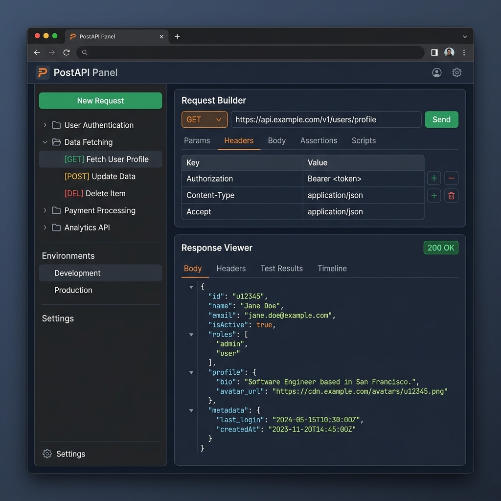
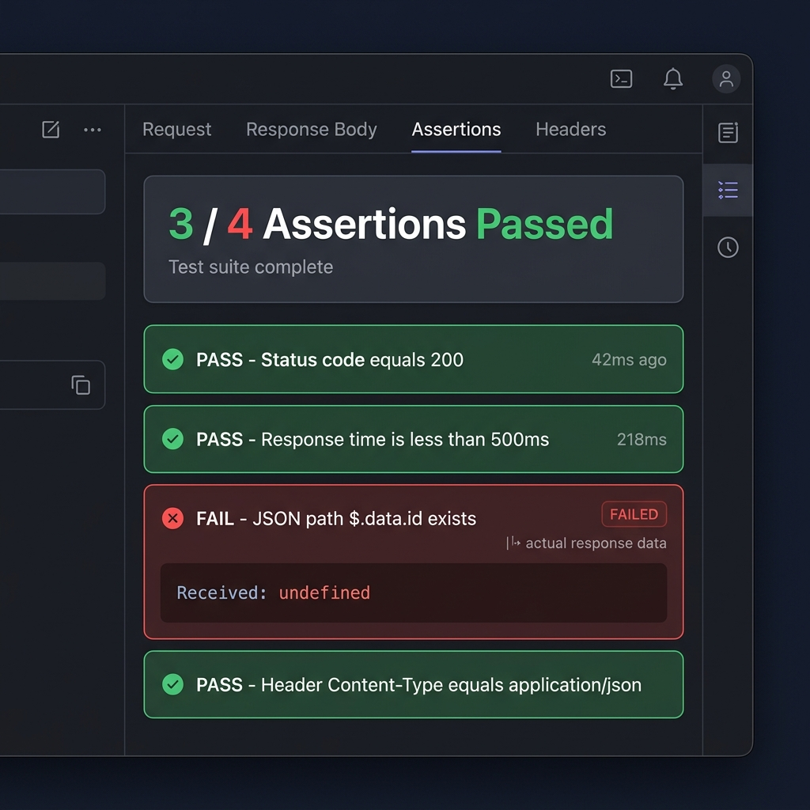

# PostAPI Panel — Chrome Extension API Client & Debugger

PostAPI Panel is a premium, developer-focused REST, SOAP, and HTTP API client built as a Chrome Extension. Directly integrated into Chrome DevTools, the Extension Action Popup, and the Side Panel, it provides a CORS-free, tab-specific playground for debugging web application endpoints.

---

## 🌟 Key Features

### 1. Dual-Pane Developer Console
* **Split Layout Interface**: Clean navigation panel for Capture, Collections, History, and Cookies alongside a split horizontal request builder/response viewer workspace.
* **Modern Design & Themes**: High-contrast charcoal and deep blue styling matching standard DevTools IDEs with full support for Light and Dark themes.

### 2. Network Request Capture (Chrome CDP)
* Hook into specific browser tabs utilizing the Chrome DevTools Protocol (CDP) to capture background XHR/Fetch requests in real-time.
* Send captured requests directly to the builder with single-click mapping of methods, query params, headers, and payloads.

### 3. Visual Assertions Validation (API Testing)
Define, execute, and verify validation rules directly on API response metadata and payloads:
* **Status Code**: Validate equality/non-equality of response statuses.
* **Header**: Verify headers exist, are absent, match specific values, or contain substrings.
* **Body Text**: Perform substring checks on the raw response payload.
* **JSON Path Queries**: Run deep-level assertions on JSON response trees (e.g., `$.data.id` is not null, `$.roles[0]` equals `'admin'`).
* **Duration Thresholds**: Validate response latency constraints (e.g. response time < 500ms).

### 4. Environments & Variable Resolution
* Define active environment variables (e.g., `host = https://api.example.com`, `token = bearer_xyz`).
* Reference variables using `{{variable_name}}` syntax inside URLs, Headers, Authentication configurations (Bearer, Basic, API Key), and Request bodies.
* **Payload Evaluation Toggle**: Opt-in or opt-out of resolving placeholders in request bodies (useful when sending raw payloads containing conflicting brackets).

### 5. Multi-Format Portability (Import & Export)
* **Seamless Import**: Support importing cURL commands, PostAPI Native collections, and Postman v2.1 collections (while preserving folder hierarchy and request templates).
* **Local Collection Export**: Download collections as formatted JSON files directly to local storage to share or backup.

### 6. Header Injection & Rules Profiles
* Inject, rewrite, append, or strip HTTP request headers dynamically across tabs using Chrome's Declarative Net Request (DNR) API.
* Support environment variables inside injected header rule values.

---

## 🛠️ Technical Architecture

* **Manifest version**: Chrome MV3.
* **Core Languages**: HTML5, Vanilla JavaScript (ES Module imports, Custom Elements).
* **Styles**: Pure Custom CSS Variables layout (maximum modularity and dark/light theme tokens).
* **Storage**: Local state management wrapping `chrome.storage.local` (data, history, collections) and `chrome.storage.sync` (user preferences).

---

## 🚀 Installation & Usage

### 1. Load the Extension
1. Clone or download this repository locally.
2. Open Google Chrome and navigate to `chrome://extensions/`.
3. Enable **Developer mode** using the toggle switch in the top-right corner.
4. Click **Load unpacked** in the top-left and select this project's directory.

### 2. Open the Console
* **DevTools Pane**: Open the browser console (`F12` or inspect page), find the **PostAPI Panel** tab, and toggle "Start Capture" to record endpoints on the inspected tab.
* **Side Panel**: Right-click the extension icon in the toolbar and choose "Open Side Panel".
* **Fullscreen Panel**: Click "FullScreen ↗" inside the extension header to open it in a dedicated browser tab.
